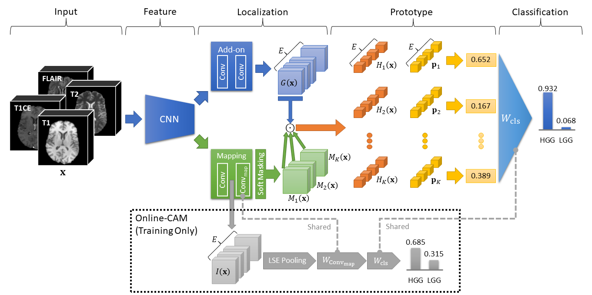

# MProtoNet

This repository contains the official implementation of MProtoNet from the paper "[MProtoNet: A Case-Based Interpretable Model for Brain Tumor Classification with 3D Multi-parametric Magnetic Resonance Imaging](https://openreview.net/forum?id=6Wbj3QCo4U4 "https://openreview.net/forum?id=6Wbj3QCo4U4")" (accepted at [MIDL 2023](https://2023.midl.io/papers/p218 "https://2023.midl.io/papers/p218")) by Yuanyuan Wei, Roger Tam, and Xiaoying Tang.

Presentation: <https://www.youtube.com/watch?v=DtfXwrliVQg>



Stay tuned for the latest updates!

- [Directory Structure](#directory-structure)
- [Dataset](#dataset)
- [Environment Configuration](#environment-configuration)
- [Experiments](#experiments)
- [Results](#results)
- [Acknowledgment](#acknowledgment)
- [Citation](#citation)
- [To-do List](#to-do-list)

## Directory Structure

- `data/`: Dataset
- `env_config/`: Environment configuration
  - `setup_conda.cmd`: Setup script (Windows) for Miniconda/Anaconda
  - `setup_conda.sh`: Setup script (Linux) for Miniconda/Anaconda
- `results/`: Results
- `src/`: Source code
  - `tumor_cls.py`: Major code for running the experiments

## Dataset

- [MICCAI Brain Tumor Segmentation (BraTS) Challenge 2020](https://www.med.upenn.edu/cbica/brats2020/ "https://www.med.upenn.edu/cbica/brats2020/") (BraTS_2020)

Please follow the instructions on the website above to request the BraTS_2020 dataset (it may take 1~4 days) and download `MICCAI_BraTS2020_TrainingData.zip` to the `data/` folder. Then unzip the dataset:

```sh
unzip ./data/MICCAI_BraTS2020_TrainingData.zip -d ./data/BraTS_2020
```

## Environment Configuration

Prerequisites: Python (>=3.7), NumPy, SciPy, scikit-learn, Matplotlib, Jupyter, PyTorch, Captum, OpenCV, TorchIO.

If you are using Miniconda/Anaconda, you can run `setup_conda.sh` (Linux) or `setup_conda.cmd` (Windows) in `env_config/`  to create a new conda environment called `mprotonet` with all the required packages (they can take up about 11 GB of disk space).

## Experiments

## Results

## Acknowledgment

## Citation

Yuanyuan Wei, Roger Tam, and Xiaoying Tang. MProtoNet: a case-based interpretable model for brain tumor classification with 3D multi-parametric magnetic resonance imaging. In *Medical Imaging with Deep Learning*, Nashville, United States, July 2023.

```bibtex
@inproceedings{wei2023mprotonet,
  title = {{{MProtoNet}}: A Case-Based Interpretable Model for Brain Tumor Classification with {{3D}} Multi-Parametric Magnetic Resonance Imaging},
  shorttitle = {{{MProtoNet}}},
  booktitle = {Medical {{Imaging}} with {{Deep Learning}}},
  author = {Wei, Yuanyuan and Tam, Roger and Tang, Xiaoying},
  year = {2023},
  month = jul,
  address = {{Nashville, United States}},
  url = {https://openreview.net/forum?id=6Wbj3QCo4U4}
}
```

## To-do List

- [x] Dataset
- [ ] Environment configuration
  - [x] Upload setup scripts for Miniconda/Anaconda
  - [ ] Upload `environment.yml` for Miniconda/Anaconda
  - [ ] Upload `requirements.txt` for pip
- [x] Upload source code
- [ ] Experiments instructions
- [ ] Results
